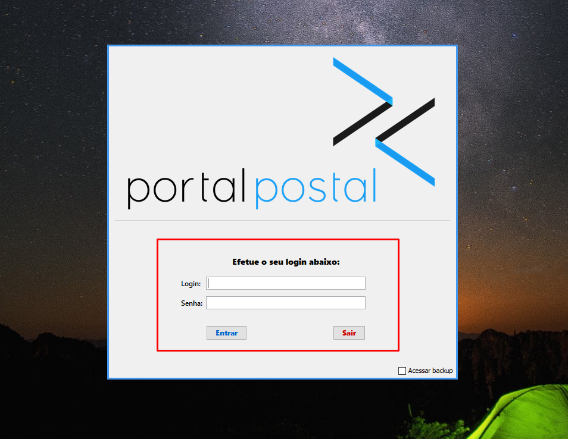

# Acesso ao Sistema Consolidador

## Acesso

Após a implantação do sistema no servidor da AGF, a Agência passa a ter acesso por meio de um aplicativo instalado localmente, cujo atalho executável pode ser replicado em outras máquinas da rede. Antes disso, a AGF (Agência Franqueada) deve executar as etapas iniciais necessárias para que seus agentes possam utilizar o sistema, realizando o cadastro de usuários administradores e usuários padrão, além de outras configurações básicas na Web da Agência.

### Acessando o Consolidador

- **Para entrar no Consolidador, basta executar o aplicativo que se encontra na sua área de trabalho e faça o Login com suas credenciais de acesso**, conforme o exemplo exibido abaixo:  
  

#### Credenciais de Acesso Iniciais

Essas credenciais são fornecidas após a AGF concluir o cadastro inicial na Web da Agência:

- **Administrador:**
  - **Usuário:** [admin@example.com](mailto:admin@example.com)
  - **Senha:** senha_admin
- **Usuário Padrão:**
  - **Usuário:** [usuario@example.com](mailto:usuario@example.com)
  - **Senha:** senha_usuario

Ao efetuar o primeiro login na Web da Agência, recomenda-se alterar a senha padrão para garantir a segurança da conta.

### Recuperação de Senha

Em caso de esquecimento da senha, o usuário deverá solicitar ao Gestor/Administrador da AGF que auxilie na redefinição de acesso. Caso o usuário seja o próprio Gestor, deve entrar em contato com o Suporte do Portal Postal.

#### Passo a passo

1. **Contato com a AGF**  
   O usuário que esqueceu a senha deve informar seu Gestor/Administrador, que o auxiliará na redefinição de acesso.  
   - Se o usuário que esqueceu a senha for o próprio Gestor, deve entrar em contato diretamente com o Suporte do Portal Postal.

2. **Verificação de Identidade**  
   Para realizar o suporte, o Portal Postal poderá solicitar informações que confirmem a identidade da Agência e do usuário.

3. **Envio do Link de Redefinição**  
   Após a confirmação da identidade, será enviado um link temporário para redefinição de senha.

4. **Redefinição da Senha**  
   Acesse o link e crie uma nova senha. Ela será armazenada de forma criptografada.

**Conformidade com a LGPD:**  
> Este processo segue os princípios básicos da Lei Geral de Proteção de Dados, preservando a privacidade e a segurança das informações pessoais do usuário.