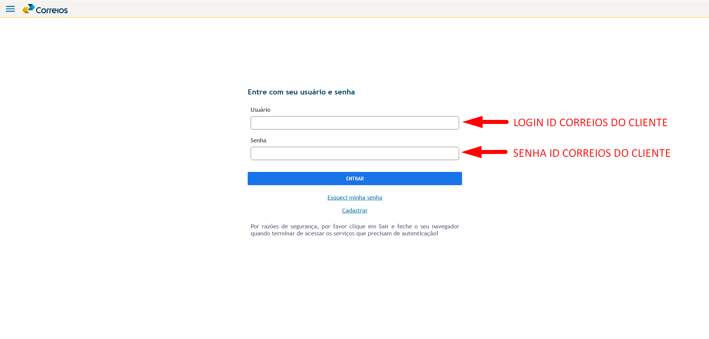
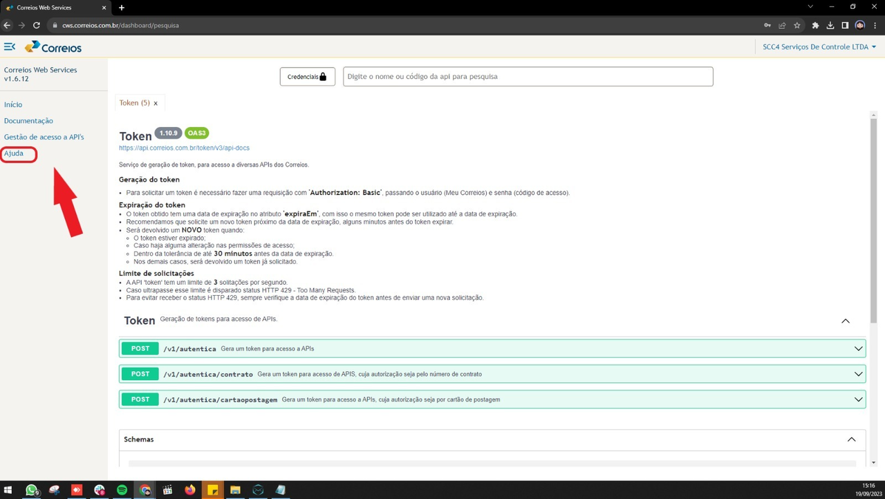
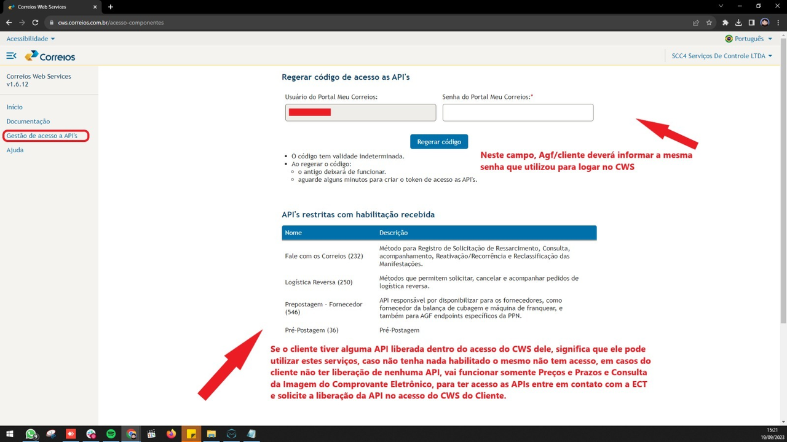

# Geração do Token nos Correios CWS / Cadastro do Portal Postal

## **1. Introdução**

Esta documentação descreve o processo de login, geração de token e autenticação no CWS - Correios, além das orientações para cadastramento de API e cartão de postagem. Este guia destina-se a AGFs e clientes que precisam acessar os serviços dos Correios via API.

---

## **2. Acesso ao CWS (Central Authentication Service - CAS)**

### **2.1 Login no CWS**

1. Acesse o portal do **CWS - Correios**.  
     
   [Login - CAS - Central Authentication Service](https://cas.correios.com.br/login?service=https%3A%2F%2Fcws.correios.com.br%2Flogin%2Fcas)

2. Utilize o **IDCorreios** para autenticação.  
   - Se o cliente não possuir o IDCorreios, ele deve verificar com a **ECT** como obter credenciais de acesso.

### **2.2 Menu de Ajuda**

- O próprio CWS possui um **Menu de Ajuda**, onde há um passo a passo explicando como gerar e autenticar o token.  
- O Portal Postal também disponibilizará esse guia.  
- Se houver dúvidas mesmo após a consulta do Menu de Ajuda, o cliente ou AGF deve entrar em contato com o **suporte do Portal Postal**.

---

## **3. Gestão de Acesso às APIs**

### **3.1 Copiando o Login e Senha para API**

1. No campo **"Usuário do Portal Meu Correios"**, copie o login exibido (este é o **login da API**).  
   - Salve esse login em um bloco de notas, para utilizá-lo posteriormente na tela de contrato ECT do Portal Postal.

2. No campo **"Senha do Portal Meu Correios"**, insira a mesma senha usada para acessar o CWS.

3. **Insira a senha** (a mesma utilizada no CWS) e clique em **"Regerar Código"**.

---

### **3.2 Gerando o Token**

1. Se um token já existir, o sistema exibirá uma mensagem de confirmação. Clique em **"Sim"** para gerar um **novo token**.  

2. O CWS exibirá o **novo token**. Copie e salve este token em um local seguro, pois ele será utilizado para:  
   - **Autenticação** no CWS.  
   - **Cadastro** na tela de contrato ECT na Web da Agência.  
   - **Configuração** no Portal Postal (inserido como **senha** da API).

---

### **3.3 APIs Habilitadas**

1. **Permaneça** na tela de **Credenciais** e insira o **token** recém-gerado (ou utilize um token válido já existente), juntamente com o **cartão de postagem**, **utilizando um duplo 00 na frente** da numeração.  
2. **Feche** a janela após a configuração. Em seguida, ao passar o mouse sobre o botão **Credenciais**, o CWS exibirá os serviços que o cliente tem liberados:  
   - Caso haja APIs **liberadas**, elas aparecerão listadas.  
   - Se **não** houver APIs habilitadas, o cliente terá acesso apenas a:  
     - **Consulta de Preços e Prazos**  
     - **Consulta de Imagem do Comprovante Eletrônico**

---

## **4. Erros Comuns e Soluções**

### **Erro "Acesso negado. Verifique o usuário e senha informados. STATUS 401"**

- Esse erro não está relacionado ao **Portal Postal**.  
- Solução recomendada:  
  1. Pressione **CTRL + F5** e refaça o processo na mesma tela.  
  2. Se o erro persistir, aguarde alguns minutos e tente novamente.  
  3. Caso o problema continue, entre em contato com a **ECT**.

---

## **5. Cadastro do Cartão de Postagem e Autenticação na API**

1. Acesse a tela de **Início** do CWS e clique em **Credenciais**.

2. No campo **Cartão de Postagem**, insira o cartão de postagem **utilizando um duplo 00 na frente**.  
   - Caso o cliente não tenha um cartão diferente, utilize o mesmo cartão de postagem.  

   - **Quando for inserir o cartão de postagem no Portal Postal, não cadastre com o duplo "00".**

3. **Cadastrar login da API e token no Portal Postal:**  
   - No campo **Login da API**, insira o **login** copiado (usuário do Portal Meu Correios).  
   - No campo **Senha**, insira o **token** gerado anteriormente.

4. **Finalização:**  
   - Se o AGF estiver fazendo o cadastro para o cliente, o acesso estará liberado após este processo.  
   - **Atenção**: Se o cliente usa este login e token em outro sistema, o AGF deve orientá-lo a atualizar os dados no outro sistema, pois a alteração do token pode causar falhas de autenticação.

---

## **6. Processo pelo Cliente (Acesso Web)**

Caso o cliente deseje realizar o processo diretamente pelo próprio acesso, ele deve:

1. Acessar o portal Web do Cliente.  
2. Ir até **Cadastro > Dados da Empresa > Login da API IDCORREIOS**.  
3. Cadastrar:  
   - **Login da API**  
   - **Senha/Token**  
   - **Cartão de postagem** (seguindo a mesma regra de **não** usar o duplo "00")

**⚠ Importante:**  
Se o cliente usa esse login e token em outro sistema, ele deve atualizá-los no outro sistema, pois qualquer alteração de token pode invalidar a autenticação nos serviços integrados.

---

## **7. Suporte**

Se houver qualquer dúvida ou erro que não seja resolvido pelas etapas descritas, o cliente ou AGF deve entrar em contato com:

- **Menu de Ajuda do CWS**  
- **Suporte do Portal Postal**  
- **Correios (ECT)**, caso o problema esteja relacionado ao IDCorreios ou credenciais de acesso

---

### **8. Considerações Finais**

Esta documentação visa facilitar o acesso e autenticação ao CWS dos Correios, bem como a geração de token e integração com APIs. Seguindo os passos corretamente, o processo deve ocorrer sem problemas.

---
