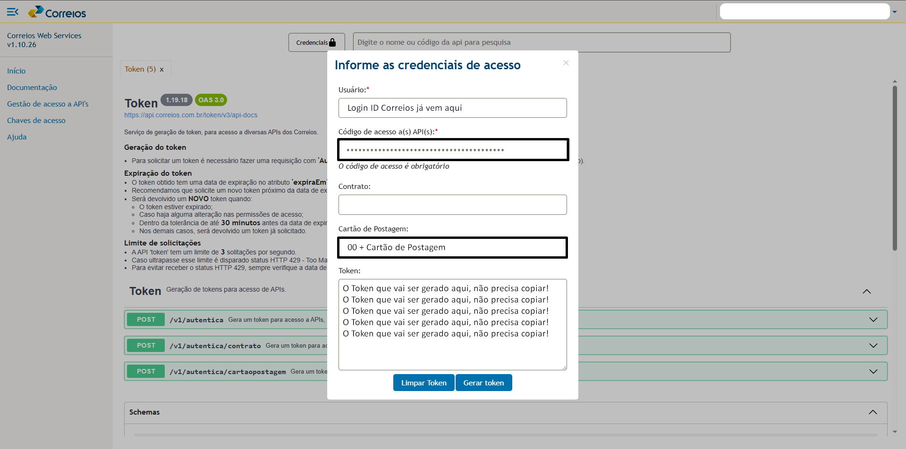

# Guia de Configuração: Correios Web Service (CWS) e Portal Postal

Este documento detalha o processo de cadastro e configuração do token do Correios Web Service (CWS) no Portal Postal para habilitar a Pré-Postagem de Objetos (PPN).

## Parte 1: CWS - Correios Web Service

O primeiro passo é obter o token de acesso na plataforma dos Correios.

**Pré-requisitos:**

* Login e senha do seu **ID Correios**.

### Obtendo o Token de Acesso

1. Acesse o site do **Correios Web Service** pelo link indicado e faça login.
   Link do site dos [Correios Web Service](https://cws.correios.com.br/).
    > 

2. Após o login, navegue no menu até a opção **"Gestão de Acesso à API"**.
    > 

3. Na tela de "Gestão de Acesso", copie o **login** informado. Você precisará dele mais tarde para configurar o Portal Postal.
    > 

4. Insira novamente a sua senha do ID Correios no campo correspondente e clique em **"Regerar código"**.
    > 

5. Um novo token será gerado. Copie este código e salve-o em um local seguro.
    > 

> **Observação Importante:**
> Antes de gerar um novo token, verifique com a sua equipe se um token já não foi gerado anteriormente. Dependendo da empresa, o mesmo token pode ser utilizado em múltiplos sistemas. Caso não haja nenhum token em uso, pode seguir com o tutorial.
> 

### Validando as Credenciais

1. Ainda no ambiente do Correios Web Service, retorne ao menu **"Início"** e clique em **"Credenciais"**.
    > 

2. Na tela de credenciais, preencha os seguintes campos:
    * **Código de acesso API:** Cole o token que você copiou e salvou no passo anterior.
    * **Contrato:** Este campo pode ser deixado em branco.
    * **Cartão de postagem:** Digite o número do cartão exatamente como está cadastrado no Portal Postal, **incluindo os dois zeros ("00") no início**.
    > 

3. Clique em **"Gerar Token"**. Este segundo token serve apenas para validar as informações.

4. Assim que o cartão de postagem for validado com sucesso, você pode fechar a janela. Não é necessário salvar este segundo token.

Com o login e o primeiro token em mãos, o próximo passo é configurar o Portal Postal.

---

## Parte 2: Portal Postal - Web da Agência

Agora, vamos inserir as informações do CWS no cadastro do cliente dentro do Portal Postal.

### Configurando o Cliente

1. No menu lateral do Portal Postal, acesse **"Cadastros"** e clique em **"Clientes"**.
    > 

2. Localize e selecione o cliente que deseja configurar. Abra a seção **"Contrato ECT"**.
    > 

3. Verifique se os dados do contrato estão atualizados conforme a nova política dos Correios e se os campos obrigatórios (como cartão de postagem e logística reversa) estão preenchidos.

4. Localize a seção de integração com o Correios Web Service e preencha os campos:
    * **Login:** Insira o login que você copiou do site CWS.
    * **Senha de acesso à API:** Cole o primeiro token que você gerou e salvou.
    > 

5. Marque a opção **"PPN"** como ativada e clique em **"Salvar"** para registrar as alterações.
    > 

### Testando a Configuração

1. Para garantir que a integração foi bem-sucedida, clique no botão **"Testar funcionamento da API"**.
    > 

2. Se a configuração estiver correta, uma mensagem de sucesso será exibida.
    > 

3. Logo abaixo, o portal exibirá a lista de APIs liberadas para este cliente. Verifique se a **API "Pré-postagem" (código 36)** está na lista, pois ela é essencial para a emissão das etiquetas.
    > 

4. Por fim, realize um teste prático: gere uma nova etiqueta de postagem diretamente pela web do cliente.

5. Se a etiqueta for emitida corretamente e contiver o **código de rastreamento (SRO)**, o processo foi finalizado com sucesso!
    > 

---
