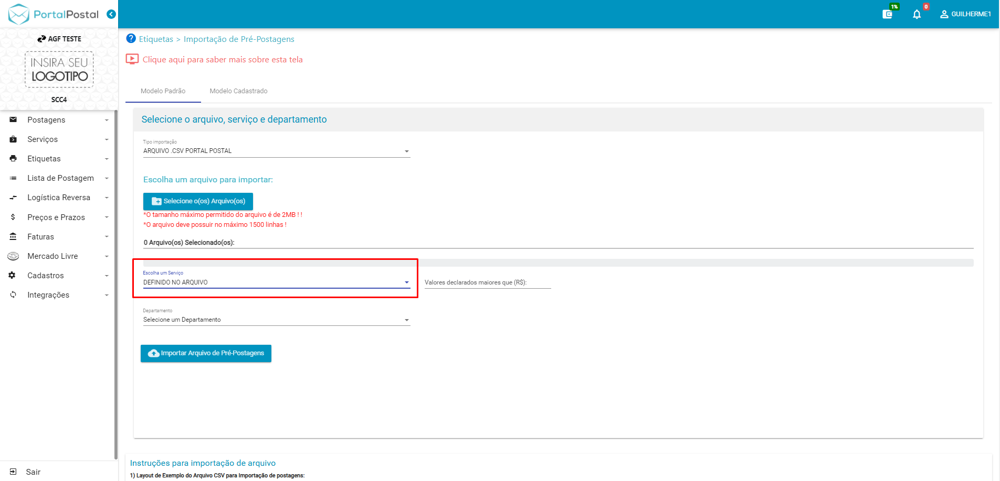

# FAQ Portal Postal Web

## Introdução e Configuração Inicial

### O que é o Portal Postal e para quem ele é indicado?

O **Portal Postal** é uma plataforma online projetada especificamente para **Agências Franqueadas dos Correios (AGFs)**. Ele facilita a gestão e automação de serviços postais realizados por empresas que utilizam as AGFs como intermediárias para suas operações logísticas.

A plataforma é indicada para AGFs que precisam gerenciar o cadastro de empresas clientes, controlar o envio e rastreamento de correspondências e encomendas, e otimizar os processos administrativos relacionados aos serviços postais.

---

### Quais navegadores são compatíveis com a plataforma?

O Portal Postal Web é compatível com navegadores modernos e atualizados, como:

- Google Chrome
- Mozilla Firefox
- Microsoft Edge
- Safari

> Para uma melhor experiência, recomenda-se utilizar a versão mais recente do navegador.

---

### Existe um aplicativo móvel para o Portal Postal Web?

Sim, o Portal Postal Web pode oferecer um aplicativo móvel disponível para download nas lojas **Google Play (Android)** e **App Store (iOS)**. Caso não exista um aplicativo dedicado, a versão web é otimizada para acesso em dispositivos móveis.

---

### Quais são os requisitos técnicos para utilizar a plataforma?

Os requisitos técnicos incluem:

- Um dispositivo com acesso à internet (computador, tablet ou smartphone).
- Um navegador compatível atualizado.
- Conexão de internet estável.

---

### Como configuro as informações da minha empresa no sistema?

1. Acesse sua conta no Portal Postal Web.
2. Vá em **Cadastros** no menu lateral e selecione **Dados da Empresa**.
3. Insira as informações da empresa, como:
   - Logotipo
   - Nome Impresso na Etiqueta
   - Dados Gerais da Empresa
   - Login API IDCorreios
   - Login da Web IDCorreios

>**Lembre-se de salvar as alterações!.**

---

## Cadastro e Gestão de Postagens

### **Atenção: Importante para o correto funcionamento do sistema**

Para evitar erros durante a importação de arquivos ou no preenchimento manual de etiquetas no portal postal, siga rigorosamente as orientações abaixo:

1. **Campos obrigatórios:**  
   - Certifique-se de que todas as informações estejam preenchidas de acordo com os campos obrigatórios exigidos pelo sistema.

2. **Respeito ao padrão de escrita:**  
   - Utilize o formato correto para cada campo. Por exemplo, o campo **UF** deve ser preenchido com a sigla (como "SP", "RJ", "MG") e **não** com o nome do estado por extenso.

3. **Atenção aos caracteres especiais:**  
   - Evite caracteres especiais, como exemplo de aspas (**" "**), ao redor dos dados nos campos, pois isso pode gerar falhas na validação.

**Importante:** A não conformidade com essas diretrizes pode resultar em erros tanto na importação dos arquivos quanto no preenchimento das etiquetas. Por isso, revise atentamente seus arquivos antes de importá-los.

---

### Como cadastro uma nova postagem no sistema?

Para cadastrar uma nova postagem você deve gerar uma **Etiqueta**, siga o passo a passo:

1. Acesse o painel principal do Portal Postal.
2. Clique em **Etiquetas**.
3. Vá em **Gerar Etiquetas**
4. Selecione o tipo de Postagem: 

5. Após selecionar o tipo de postagem preencha os campos não esquecendo dos obrigatórios:
   - Dados do Remetente (Departamento,Setor(Se tiver cadastrado)).
   - Destinatário (nome/razão social, empresa, CPF, CNPJ, e-mail, telefone, CEP, UF(Não deve ser escrita por extenso), endereço etc.).
   - Dados do Objeto (Caixa ou envelope, Observações, NF ou Declaração de conteúdo).
   - Serviços Adicionais (AR, VD, MP, AE, AD, DC Entrega no vizinho, RFID).
   

6. Revise as informações e clique em **Gerar Etiqueta**. 

7. Após revisar as informações na tela, você pode **Confirmar Pré-Postagem**. 

8. Ao Realizar a confirmação de Pré-Postagem, já fica disponivel a **Etiqueta** para impressão. 

9. Aqui você já consegue visualizar a impressão da etiqueta, caso tenha AR e seja DC também tem a opção da impressão. 

---

### É possível cadastrar postagens em massa? Como faço isso?

Sim, o sistema permite o cadastro em massa de postagens utilizando a importação de arquivos em formatos como **CSV**, **Excel**, **XML** e outros. Para isso existe dois métodos de importação, modelo padrão ou modelo cadastrado.

---

Para o **Modelo Padrão**:

1. Selecione o Tipo do arquivo de Importação. 

2. Ao Selecionar o Tipo de arquivo, o Portal disponibiliza um arquivo de exemplo, como deve ser seguido esse modelo e especifica os campos que são obrigatórios ter informações.

3. Selecione o arquivo que vai ser Importado, seguindo o tipo que foi definido. 

4. Especifique o tipo de serviço que é a importação (Definido no arquivo, PAC, SEDEX, Carta Registrada etc). 

5. Caso você escolha outros tipos de serviço, diferente de **Definido no arquivo**, precisa marcar os campos de **Medicamento Controlado, VD e AR**. 

6. Caso seu arquivo venha com os valores das mercadorias, e você deseja selecionar o valor declarado para objetos acima de cem reais, basta informar no campo **Valores Declarados Maiores Que**, indicando apartir do valor que você quer que o sistema considere. 

7. Selecione o Departamento (**somente se houver separação por departamento definido no Cliente**). 

8. Com todos os parametros marcados, pode seguir com o botão **Importar Arquivo de Pré-Postagens**. 

9. Realizada a Importação com sucesso, é notificada uma mensagem na tela de confirmação. 

10. Nessa tela, você consegue verificar todas as **Pré-Postagens importadas**, que após selecionado o botão de **Validar Pré-Postagens** pode acusar algum tipo de erro, como um **CEP inválido** ou **ausência de informações obrigatórias**, é possivel tambem desmarcar alguma linha importada caso haja algum problema sinalizado em vermelho, não afetando o restante que deseja continuar no processo. Para seguir basta ir no botão **Confirmar Pré-Postagens**. 

11. Com a confirmação das **Pré-Postagens realizadas**, já é possivel imprimir todas etiquetas geradas indo em **Imprimir Selecionados**. 

>### Para continuar nesse passo a passo do **modelo cadastrado** primeiro você deve cadastrar um modelo caso ainda não tenha, seguindo esse tutorial: [Layout de Importação](https://guilhermefoliveira.github.io/scc4/docs/SCC4/faq-portalpostal/#%C3%A9-poss%C3%ADvel-personalizar-as-minhas-importa%C3%A7%C3%B5es-em-massa-conforme-minhas-planilhas-est%C3%A3o-configuradas)

Para o **Modelo Cadastrado**:

1. Selecione o Tipo do arquivo de Importação, conforme o nome do modelo que foi **cadastrado no Layout de Importação**. 

2. Selecione o arquivo que vai ser Importado, seguindo o tipo cadastrado. 

3. Especifique o tipo de serviço que é a importação (Definido no arquivo, PAC, SEDEX, Carta Registrada etc).  

4. Caso você escolha outros tipos de serviço, diferente de **Definido no arquivo**, precisa Marcar os campos de Medicamento Controlado, VD e AR. 

5. Caso seu arquivo venha com os valores das mercadorias, e você deseja selecionar o valor declarado para objetos acima de cem reais, basta informar no campo **Valores Declarados Maiores Que**, indicando apartir do valor que você quer que o sistema considere. 

6. Selecione o Departamento (**somente se houver separação por departamento definido no Cliente**). 

7. Com todos os parametros marcados, pode seguir com o botão **Importar Arquivo de Pré-Postagens**. 

8. Realizada a Importação com sucesso, é notificada uma mensagem na tela de confirmação. 

9. Nessa tela, você consegue verificar todas as **Pré-Postagens importadas**, que após selecionado o botão de **Validar Pré-Postagens** pode acusar algum tipo de erro, como um **CEP inválido** ou **ausência de informações obrigatórias**, é possivel tambem desmarcar alguma linha importada caso haja algum problema sinalizado em vermelho, não afetando o restante que deseja continuar no processo. Para seguir basta ir no botão **Confirmar Pré-Postagens**. 

10. Com a confirmação das **Pré-Postagens realizadas**, já é possivel imprimir todas etiquetas geradas indo em **Imprimir Selecionados**. 

---

### Posso importar listas de postagens de um arquivo CSV ou Excel?

Sim, o sistema aceita arquivos **CSV**,**Excel** e outros tipos para importação. Siga o mesmo processo descrito acima para garantir que o formato esteja correto.

---

### É possível personalizar as minhas importações em massa, conforme minhas planilhas estão configuradas?

Sim...

---

### Como editar ou excluir uma postagem já cadastrada?

- **Editar:**
  1. Vá até o menu de **Postagens Cadastradas**.
  2. Localize a postagem utilizando os filtros disponíveis.
  3. Clique em **Editar**, altere as informações e salve.
- **Excluir:**
  1. Localize a postagem no menu correspondente.
  2. Clique em **Excluir** e confirme.

> Observação: Postagens já processadas ou enviadas podem não ser editáveis ou excluíveis.

---

### É possível salvar rascunhos de postagens para editar depois?

Sim, o sistema permite salvar postagens como **Rascunho**. Para isso:

1. Preencha as informações da postagem.
2. Em vez de finalizar, clique em **Salvar como Rascunho**.
3. Você pode acessar e editar os rascunhos posteriormente.

---

### O sistema permite a categorização das postagens por cliente ou tipo de envio?

Sim, é possível categorizar as postagens. Algumas opções incluem:

- **Por Cliente:** Associe cada postagem a um cliente específico.
- **Por Tipo de Envio:** Classifique as postagens como PAC, SEDEX, Carta Registrada, entre outros.

---

## Etiquetas e Documentos

### Como gerar etiquetas para minhas postagens?

1. Vá até o menu **Etiquetas**.
2. Escolha a postagem desejada ou gere etiquetas em lote.
3. Clique em **Gerar Etiqueta**.

---

### É possível personalizar o layout das etiquetas?

Sim, o sistema permite a personalização de etiquetas, incluindo o logotipo da AGF e campos customizáveis. Entre em contato com o suporte para ajustes avançados.

---

### O que fazer se a etiqueta não estiver sendo gerada corretamente?

Certifique-se de que todas as informações obrigatórias da postagem estão preenchidas. Caso o problema persista, entre em contato com o suporte técnico.

---

### Como imprimo várias etiquetas de uma vez?

Selecione múltiplas postagens no menu **Etiquetas** e clique em **Gerar Etiquetas em Lote**. Em seguida, envie o arquivo para impressão.

---

### O sistema suporta impressão de etiquetas em impressoras térmicas?

Sim, o sistema é compatível com impressoras térmicas. Verifique o modelo e as configurações recomendadas no manual técnico ou com o suporte.

---

## Listas de Envio

### Como organizo minhas postagens em listas de envio?

1. Acesse o menu **Listas de Envio** no sistema.
2. Clique em **Criar Nova Lista**.
3. Adicione os objetos ou postagens desejados à lista.
4. Salve a lista para processamento posterior ou continue com a geração.

---

### Posso enviar uma lista para múltiplos destinos em uma única operação?

Sim, é possível criar uma lista contendo objetos com diferentes destinos. O sistema processará cada envio conforme a configuração individual dos objetos.

---

### Existe algum limite para o número de itens em uma lista de envio?

O limite pode variar conforme as configurações do sistema ou contrato com os Correios. Consulte o suporte técnico caso enfrente restrições inesperadas.

---

### É possível exportar as listas de envio para outros formatos?

Sim, as listas de envio podem ser exportadas para formatos como **CSV** ou **Excel**. Basta selecionar a lista e clicar na opção **Exportar** no menu.

---

## Logística Reversa

### Como cadastro um pedido de logística reversa no sistema?

1. Acesse o menu **Logística Reversa**.
2. Clique em **Nova Autorização**.
3. Insira os dados do destinatário e os detalhes do envio.
4. Confirme para gerar a autorização de postagem.

---

### Posso acompanhar o status dos processos de logística reversa?

Sim, o sistema permite rastrear e acompanhar o status de todas as autorizações de logística reversa cadastradas.

---

### Quais transportadoras são compatíveis para logística reversa?

O Portal Postal Web utiliza os serviços dos Correios para logística reversa. Outras transportadoras podem ser adicionadas dependendo de integrações configuradas.

---

### O que fazer se a logística reversa não for aceita pelo parceiro logístico?

1. Verifique as informações da autorização no sistema.
2. Certifique-se de que os dados do destinatário estão corretos.
3. Entre em contato com o suporte para solucionar possíveis erros.

---

## Cálculo de Prazos e Valores

### Como faço para consultar prazos e valores de envio?

1. Acesse o menu **Cálculo de Frete**.
2. Insira as informações do remetente, destinatário e detalhes do envio.
3. O sistema mostrará os prazos e valores disponíveis.

---

### O sistema permite comparar prazos e valores entre diferentes transportadoras?

Sim, caso haja integrações configuradas com múltiplas transportadoras, o sistema exibirá as opções para comparação.

---

### Por que os valores mostrados no sistema estão diferentes do site da transportadora?

Diferenças podem ocorrer devido a:

- Atualizações na tabela de tarifas.
- Configurações específicas de contrato.
- Serviços adicionais que podem ter sido incluídos no cálculo.

---

### É possível salvar as simulações de prazos e valores realizadas no sistema?

Sim, você pode salvar ou exportar as simulações para consulta posterior.

---

## Integrações com Parceiros

### Quais plataformas são compatíveis com o Portal Postal Web?

O Portal Postal Web é compatível com plataformas de e-commerce, ERPs e marketplaces, como:

- Magento
- Shopify
- WooCommerce
- Bling

---

### Como configuro a integração com um parceiro logístico?

1. Acesse o menu **Integrações**.
2. Escolha o parceiro desejado e insira as credenciais de API fornecidas.
3. Salve as configurações para ativar a integração.

---

### É possível integrar o Portal Postal Web com sistemas de e-commerce?

Sim, o sistema suporta integração com diversas plataformas de e-commerce por meio de APIs ou plugins.

---

### O que fazer se a integração com um parceiro apresentar erros?

1. Verifique as configurações de API e credenciais inseridas.
2. Certifique-se de que a conta do parceiro está ativa.
3. Entre em contato com o suporte para obter assistência.

---

## Relatórios e Dados

### O sistema gera relatórios de desempenho das postagens?

Sim, o sistema oferece relatórios detalhados com métricas como prazos de entrega, volumes enviados e custos.

---

### Quais tipos de relatórios estão disponíveis?

Os principais relatórios incluem:

- Desempenho de postagens.
- Custos por cliente ou serviço.
- Histórico de envios.
- Relatórios financeiros.

---

### Posso exportar os relatórios para PDF ou Excel?

Sim, todos os relatórios podem ser exportados nos formatos **PDF** ou **Excel** para análises externas.

---

### Como visualizar o histórico de postagens e envios?

1. Acesse o menu **Histórico de Envios**.
2. Use os filtros disponíveis para refinar a busca por data, cliente ou serviço.

---

## Erros Comuns e Soluções

### O que fazer se não consigo acessar minha conta?

1. Verifique suas credenciais de login.
2. Utilize a opção **Esqueci minha senha** para redefini-la.
3. Entre em contato com o suporte caso o problema persista.

---

### O sistema apresenta lentidão. Como resolver?

1. Certifique-se de que sua conexão de internet está estável.
2. Tente acessar a plataforma em um navegador atualizado.
3. Caso o problema persista, contate o suporte técnico.

---

### Por que minha etiqueta está saindo com informações incorretas?

1. Verifique os dados da postagem no sistema.
2. Certifique-se de que a etiqueta foi gerada após todas as alterações.
3. Reimprima a etiqueta corrigida, se necessário.

---

### Recebo uma mensagem de erro ao tentar cadastrar uma postagem. O que significa?

A mensagem de erro geralmente indica informações ausentes ou inválidas. Revise os dados obrigatórios e tente novamente.

---

### Como resolver problemas de integração com parceiros?

1. Verifique a conexão e as credenciais da API.
2. Consulte os logs de integração no sistema.
3. Solicite suporte técnico para análise detalhada.

---

### O que fazer se as postagens não estão sendo atualizadas no sistema?

1. Confirme se as PLPs estão sendo enviadas corretamente.
2. Verifique as atualizações do sistema em busca de atrasos na sincronização.
3. Contate o suporte técnico para solução.

---

## Suporte e Contato

### Como entro em contato com o suporte técnico do Portal Postal Web?

Você pode entrar em contato com o suporte por meio de:

- Chat dentro da plataforma.
- E-mail.
- Telefone de atendimento.

---

### O sistema oferece suporte em tempo real?

Sim, o suporte pode ser acessado em tempo real por chat durante o horário comercial.

---

### Existe uma central de ajuda ou tutorial dentro da plataforma?

Sim, a plataforma conta com uma central de ajuda e tutoriais para guiar o usuário.

---

### Quais são os horários de atendimento ao cliente?

O atendimento geralmente funciona em horário comercial, das 9h às 18h, em dias úteis.

---
