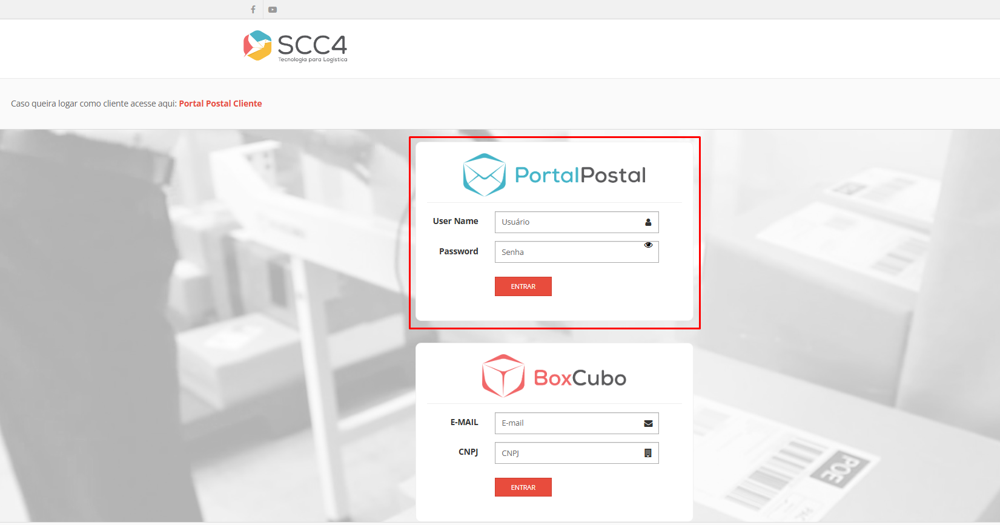

# Acesso ao Sistema Portal Postal Web - Agência

## Acesso

Após a implantação do sistema, a agência terá acesso à plataforma da Web Agência através de uma URL específica e credenciais iniciais. Antes do início da operação, o responsável pela agência deve realizar as configurações básicas e o cadastro dos usuários necessários.

### Acesso via Navegador

- **Tela de Acesso**, exemplo: 
- **URL de Acesso:** [https://portalpostal.com.br/index.jsp](https://portalpostal.com.br/index.jsp)

Utilize um navegador de internet (como Chrome, Firefox ou outro) e digite o endereço acima para acessar o sistema.

#### Credenciais de Acesso Iniciais

As credenciais são fornecidas após o cadastro inicial da agência no sistema:

- **Administrador da Agência:**
  - **Usuário:** [admin.agencia@example.com](mailto:admin.agencia@example.com)
  - **Senha:** senha_admin_agencia

Recomenda-se alterar a senha padrão no primeiro acesso para aumentar a segurança da conta.

### Configuração Inicial

Após o login inicial, o administrador da agência deve realizar as seguintes tarefas:

1. **Cadastro de Usuários:**  
   Adicione os usuários que terão acesso ao sistema, como operadores e gerentes.
2. **Configuração de Serviços:**  
   Defina quais serviços estarão disponíveis, como postagem, rastreamento e geração de relatórios.
3. **Testes de Funcionalidade:**  
   Execute testes básicos para garantir que o sistema está funcionando corretamente.

### Recuperação de Senha

Em caso de esquecimento de senha, o responsável pela agência deverá entrar em contato com o suporte técnico do Portal Postal para solicitar a redefinição.

#### Passo a passo

1. **Contato com o Suporte:**  
   Entre em contato com o suporte do Portal Postal por meio dos canais indicados (telefone, e-mail ou portal de suporte).

2. **Verificação de Identidade:**  
   O suporte poderá solicitar informações para validar a identidade do administrador ou usuário autorizado.

3. **Envio do Link de Redefinição:**  
   Após a validação, o suporte enviará um link temporário para a redefinição de senha.

4. **Redefinição da Senha:**  
   Acesse o link fornecido e crie uma nova senha, garantindo que seja segura e forte.

**Conformidade com a LGPD:**  
>Este processo segue os princípios estabelecidos pela Lei Geral de Proteção de Dados, garantindo a segurança e privacidade das informações dos usuários e clientes. 